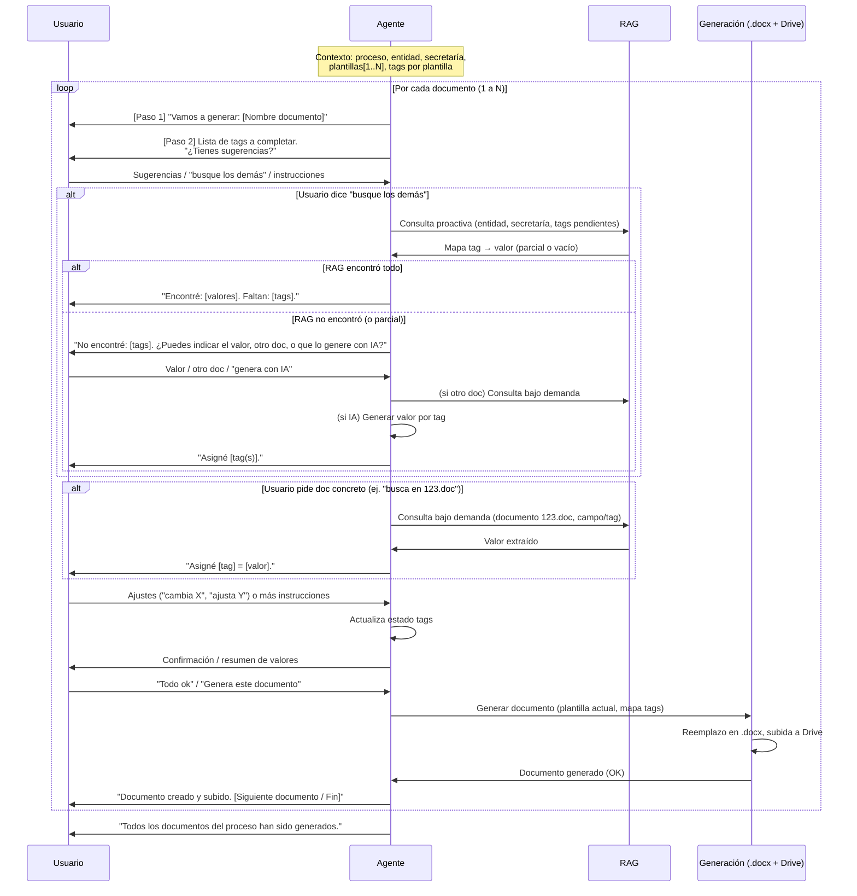
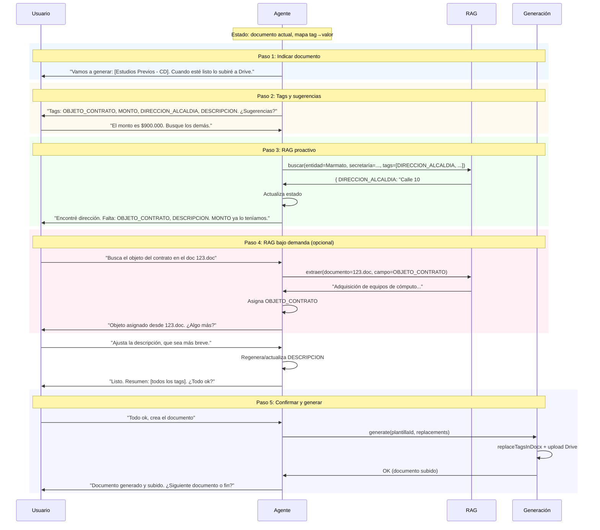

# RFC-002: Generación conversacional de documentos (uno a uno, con RAG proactivo y bajo demanda)

**Estado:** Borrador  
**Fecha:** 2026-02-03  
**Autor:** Equipo EVA Jurídico  
**Relación:** Complementa RFC-001 (Alternativa B); describe el flujo detallado de la **nueva opción** conversacional.

---

## 1. Resumen

Se propone una **nueva opción** de generación de documentos que coexiste con la actual: una interfaz **conversacional** que se activa **después** de que el usuario haya elegido proceso, entidad, secretaría y tipo de proceso. La generación se hace **documento por documento** (uno a uno cuando hay varias plantillas). En cada documento el agente: (1) indica qué documento se va a generar; (2) muestra los tags a completar y pide sugerencias al usuario; (3) si el usuario pide “busque los demás”, el sistema **consulta RAG de forma proactiva** usando el contexto (entidad, secretaría, etc.); (4) el usuario puede dar instrucciones puntuales (ej. “busca el objeto del contrato en el doc 123.doc”); (5) cuando el usuario confirma “todo ok”, **desde el mismo agente** se dispara la generación de ese documento; si hay más documentos del proceso, se continúa con el siguiente hasta finalizar. El RAG se usa tanto **proactivamente** (llenar según contexto y selección) como **bajo demanda** (cuando el usuario indica un documento o campo concreto).

---

## 2. Posicionamiento: nueva opción junto a la existente

- **Se mantiene el flujo actual:** formulario por plantilla, campos dinámicos, “Mejorar con IA”, “Generar Este” / “Generar Todos”, sin cambios para quien prefiera ese flujo.
- **Se añade una opción nueva:** “Generar documentos con el asistente” (o similar), de interfaz **conversacional**, que se ofrece **después** de elegir proceso, entidad, secretaría y tipo de proceso (mismo punto de partida que el diálogo actual).
- El usuario elige explícitamente entre:
  - **Opción A (actual):** abrir el diálogo de generación con formulario por plantilla.
  - **Opción B (nueva):** abrir la experiencia conversacional con el agente para completar tags y generar documento a documento.

Ambas opciones comparten: proceso, entidad, secretaría, tipo de proceso, plantillas asociadas y el mismo backend de generación (.docx + subida a Drive). Solo cambia la forma de completar los tags (formulario vs. conversación).

---

## 3. Flujo general: un documento a la vez

Cuando hay **varios** documentos (plantillas) asociados al proceso, el flujo es **secuencial**:

1. Se trabaja el **documento 1**: conversación → completar tags → usuario confirma → **se genera el documento 1** (reemplazo + subida a Drive).
2. Se pasa al **documento 2**: el agente indica que sigue con el siguiente, se repite el ciclo (tags, sugerencias, RAG, ajustes, confirmación, generación).
3. Se repite hasta **documento N**. Al finalizar el último, el agente indica que todos los documentos del proceso han sido generados.

Si el proceso tiene **un solo** documento, hay un único ciclo.

---

## 4. Ciclo por documento (5 pasos)

Para **cada** documento del proceso, el flujo es el siguiente.

### Paso 1: Indicar qué documento se va a generar

- El agente **inicia** el ciclo para esa plantilla indicando de forma clara qué documento se va a generar.
- Ejemplo: *“Vamos a generar el documento **Estudios Previos - Contratación Directa**. Cuando tengamos listos los datos, lo crearé y lo subiré a Drive.”*
- Así el usuario siempre sabe en qué documento está y evita confusiones cuando hay varios.

### Paso 2: Mostrar los tags y pedir sugerencias

- El agente **muestra en la conversación** la lista de **tags** que deben completarse para este documento (ej. `OBJETO_CONTRATO`, `MONTO`, `DIRECCION_ALCALDIA`, `DESCRIPCION`, …), usando los nombres de las variables o etiquetas legibles.
- A continuación **pide al usuario si tiene sugerencias** para esos tags, para iniciar la conversación.
- Ejemplo: *“Para este documento necesito completar: Objeto del contrato, Monto, Dirección de la alcaldía, Descripción. ¿Tienes alguna sugerencia o información que quieras que use para alguno de estos campos?”*
- El usuario puede responder en lenguaje libre: montos, conceptos, indicar “el objeto es X”, “busca los demás”, etc. El agente mantiene **contexto** (estado tag → valor) durante toda la conversación de este documento.

### Paso 3: “Busque los demás” – RAG proactivo según contexto

- Si el usuario indica algo como **“busque los demás”** o “complete el resto con lo que tenga”, el sistema debe **buscar en RAG de forma proactiva** para rellenar los tags que faltan.
- La búsqueda en RAG se hace usando el **contexto ya seleccionado**: entidad, secretaría, tipo de proceso y, si aplica, municipio, nombre de la entidad, etc.
- Ejemplo: para el tag `DIRECCION_ALCALDIA`, dado que la entidad seleccionada es “Alcaldía de Marmato”, se consulta RAG (p. ej. documento o índice “direcciones de alcaldías”) con clave “Marmato” (o el identificador de la entidad) y se obtiene la dirección para rellenar ese tag.
- Otros tags que se puedan resolver por entidad/secretaría (NIT, representante legal, etc.) se completan de la misma forma. Los que no tengan fuente en RAG quedan pendientes para que el usuario los indique o se pida en el siguiente turno.
- El agente **muestra** qué valores se obtuvieron del RAG y confirma cuáles tags siguen vacíos, invitando al usuario a completarlos o a dar más instrucciones.

### Paso 4: Instrucciones puntuales – RAG bajo demanda

- El usuario puede dar **instrucciones puntuales** sobre un documento o un campo concreto.
- Ejemplo: *“Busca el objeto del contrato en el documento llamado 123.doc”* o *“El valor para OBJETO_CONTRATO está en el archivo 123.doc”*.
- En ese caso el sistema realiza una **consulta RAG bajo demanda**: localiza el documento (por nombre o id, ej. “123.doc”), extrae la información relevante para ese campo (objeto del contrato) y la asigna al tag correspondiente.
- El agente confirma qué valor se extrajo y lo incorpora al estado del documento. Así se combina el RAG **proactivo** (paso 3, según entidad/secretaría) con el RAG **bajo demanda** (paso 4, según lo que pida el usuario).

### Paso 5: “Todo ok” – Generar desde el agente y seguir con el siguiente

- Cuando el usuario indica que está conforme (ej. *“todo ok”*, *“listo”*, *“genera este documento”*), el sistema interpreta la **confirmación** para ese documento.
- **Desde el mismo agente** (misma interfaz conversacional) se dispara la **generación** del documento actual: se toma el estado final de tags, se llama al flujo de generación existente (reemplazo en la plantilla .docx + subida a Drive) y se confirma al usuario que el documento fue creado y subido.
- Si el proceso tiene **más documentos** asociados:
  - El agente indica que pasará al siguiente documento (vuelve al **Paso 1** para la siguiente plantilla).
  - Se repite el ciclo (pasos 1–5) para el siguiente documento hasta completar todos.
- Si era el **último** documento, el agente cierra el flujo indicando que todos los documentos del proceso han sido generados.

---

## 5. Resumen del uso de RAG

| Momento | Tipo | Ejemplo |
|---------|------|--------|
| **Paso 3** | **Proactivo** | Usuario dice “busque los demás”. Sistema consulta RAG usando entidad, secretaría, tipo de proceso (y fuentes configuradas por tipo de tag) y rellena todos los tags que pueda (dirección, NIT, etc.). |
| **Paso 4** | **Bajo demanda** | Usuario dice “busca el objeto del contrato en el doc 123.doc”. Sistema consulta RAG para ese documento y ese campo y asigna el valor al tag correspondiente. |

Ambos usos pueden darse en la misma conversación de un mismo documento.

### 5.1 Cuando RAG no encuentra resultados (fallback)

Si el RAG **no encuentra** información para uno o varios tags (consulta proactiva o bajo demanda), el sistema **no debe bloquear** el flujo: debe informar al usuario e **intentar obtener la información** por otros medios.

**Comportamiento esperado:**

1. **Informar con claridad:** El agente indica qué tags **no** pudieron completarse con RAG (ej. *“No encontré en las fuentes disponibles: DIRECCION_ALCALDIA, NIT_ENTIDAD. Sí pude completar: OBJETO_CONTRATO.”*).
2. **Pedir la información al usuario:** El agente **pide explícitamente** que el usuario proporcione el valor para esos tags o que indique otra fuente. Ejemplo: *“¿Puedes indicarme la dirección de la alcaldía y el NIT, o decirme en qué documento buscarlos?”*
3. **Opciones que el usuario puede dar:**
   - **Escribir el valor** en el chat (ej. “La dirección es Calle 10 # 5-20”); el agente lo asigna al tag correspondiente.
   - **Indicar otro documento** para RAG bajo demanda (ej. “Busca la dirección en el doc Datos_Marmato.pdf”); el sistema intenta de nuevo con esa fuente.
   - **Pedir que la IA lo genere o amplíe** (ej. “Genera tú la descripción con base en el objeto del contrato”); el agente usa generación por IA (similar a improve-text / generate-field) con el contexto disponible y asigna el resultado al tag.
4. **Reintento opcional en RAG:** Si la primera consulta fue por entidad/secretaría y no hubo resultado, el agente puede sugerir al usuario que indique un documento concreto para ese tag (pasando a RAG bajo demanda) o que ingrese el valor manualmente.
5. **No generar con tags vacíos (o con placeholder):** Si tras estos intentos un tag sigue vacío, el agente debe **recordar al usuario** antes de “todo ok” (ej. “Falta OBJETO_CONTRATO. ¿Lo escribes o quieres que lo genere con IA?”). La generación del .docx puede rechazar tags obligatorios vacíos o dejarlos como placeholder según la política del producto; en cualquier caso, el agente debe intentar conseguir la información antes de dar por cerrado el documento.

En resumen: **si RAG no encuentra, el agente intenta conseguir la información** pidiéndola al usuario, probando otra fuente (RAG bajo demanda) o generándola con IA cuando tenga sentido, y solo cierra el documento cuando el usuario confirma o cuando se acepta dejar un tag vacío/placeholder.

---

## 6. Interfaz y punto de entrada

- **Cuándo aparece la opción:** Después de que el usuario haya elegido (o creado) el **proceso** y con él la **entidad**, **secretaría** y **tipo de proceso**. En la misma pantalla o menú donde hoy se ofrece “Generar documentos” (formulario), se ofrece además la **nueva opción** conversacional (ej. “Generar documentos con el asistente” o “Completar documentos en chat”).
- **Qué se abre:** Una interfaz **conversacional** (chat con el agente) en la que:
  - El agente ya tiene contexto: proceso, entidad, secretaría, tipo de proceso, lista de plantillas (documentos) a generar y, por cada plantilla, la lista de tags.
  - La conversación sigue el flujo de 5 pasos por documento y, al confirmar, se dispara la generación sin salir del chat.
- **Estado:** El agente mantiene por sesión/conversación: (1) índice del documento actual (cuál de N); (2) estado de tags del documento actual; (3) historial de mensajes para contexto.

---

## 7. Requerimientos técnicos (resumen)

- **Agente con estado:** Por conversación, estado “documento actual” (plantilla + mapa tag → valor). Al confirmar “todo ok”, ejecutar generación para esa plantilla y avanzar al siguiente documento.
- **RAG proactivo:** Servicio o herramienta que, dado (entidad, secretaría, tipo de proceso, tags pendientes), consulte las fuentes RAG configuradas y devuelva un mapa tag → valor para los que haya resultado. Invocado cuando el usuario pida “busque los demás” (o equivalente).
- **RAG bajo demanda:** Herramienta que reciba (nombre o id de documento, campo/tag opcional) y devuelva el valor extraído. Invocada cuando el usuario indique un documento concreto (ej. “123.doc”) para un campo.
- **Fallback cuando RAG no encuentra:** El agente debe informar qué tags no se pudieron completar, pedir al usuario el valor o otra fuente (documento alternativo), y ofrecer generación por IA para ese tag si aplica. No bloquear el flujo; intentar obtener la información antes de cerrar el documento (ver § 5.1).
- **Detección de intenciones:** “Busque los demás” (disparar RAG proactivo), “busca [campo] en [doc]” (disparar RAG bajo demanda), “todo ok” / “genera” (confirmar y generar documento actual).
- **Integración con generación existente:** Reutilizar la lógica actual de reemplazo de tags y subida a Drive (ej. `/api/generate-document` o equivalente) para cada documento cuando el agente dispare la generación.

---

## 8. Próximos pasos

1. Definir el **punto de entrada** en la UI (botón o enlace “Generar documentos con el asistente”) tras la selección de proceso/entidad/secretaría.
2. Diseñar la **pantalla o panel de chat** (misma zona que el asistente actual o vista dedicada) y el contrato de mensajes con el agente (incl. cuando el agente “muestra” la lista de tags y el resumen de valores).
3. Implementar el **flujo uno a uno** en el agente: secuencia documento 1 → … → documento N y transición al siguiente al confirmar generación.
4. Implementar **RAG proactivo** (paso 3): fuentes, índice y mapeo (entidad, secretaría, tipo de proceso → consultas por tag).
5. Implementar **RAG bajo demanda** (paso 4): resolución de documento por nombre/id y extracción por campo/tag.
6. Conectar la señal “todo ok” del agente con la **generación real** del .docx y subida a Drive, y con el avance al siguiente documento o cierre del flujo.

---

## 9. Diagramas de secuencia

### 9.1 Flujo global (varios documentos, uno a uno)

El siguiente diagrama muestra la secuencia entre usuario, agente, RAG y el servicio de generación cuando el proceso tiene **varios** documentos. El ciclo por documento se repite hasta completar todos.



### 9.2 Ciclo detallado por un documento (5 pasos)

Detalle de la interacción para **un solo** documento: los cinco pasos y las posibles consultas a RAG (proactiva y bajo demanda).



### 9.3 Decisión: siguiente documento o fin

```mermaid
flowchart LR
    A[Usuario: "Todo ok"] --> B[Agente dispara generación]
    B --> C{¿Quedan más<br/>documentos?}
    C -->|Sí| D[Paso 1 para doc N+1]
    C -->|No| E[Agente: "Todos los documentos generados"]
    D --> F[Ciclo 5 pasos]
    F --> A
```

---

## 10. Referencias

- **RFC-001:** Alternativas para completar documentos (Alternativa B: flujo conversacional).
- Flujo actual de generación: `components/member/generate-documents-dialog.tsx`, `app/api/generate-document/route.ts`.
- Agente/workflow: `app/api/assistant/route.ts`, `lib/ai-chat/workflow-runner.ts`.
